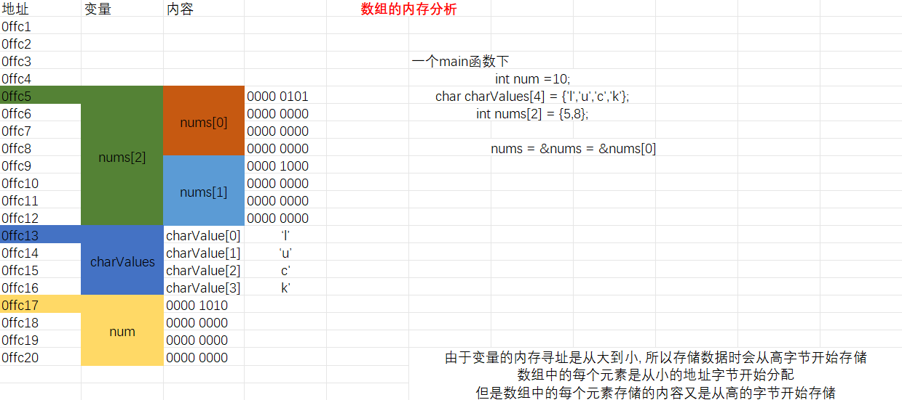

[toc]
# 数组
C语言除了**基本类型**(int,char,float,double等)的数据,还有**构造类型**的数据,如==数组类型,结构类型,联合类型==.==构造类型数据是由基本类型数据按照一定规则组织而成==,需要在使用之前进行定义,并按照语言规则的要求进行使用.

数组是**有序数据的集合**,==由"数组名"唯一命名==.数组的每个元素都具有**相同的数据类型**.用**数组名和下标方式**可以唯一缺点数组中的元素
## 一维数组
### 一维数组的声明
声明一维数组的一般形式为:  
`[存储形式说明符] [类型修饰符] 类型说明符 数组名[常量表达式]={初值列表};`
- 存储类型说明符可以是`extern`或`static`,分别用于声明**外部数组**和**静态数组**.
- 类型修饰符可以是`const`和`volatile`,分别用于声明**常量数组**和**易失性数组**
  -  **const修饰数组**:
        - 当数组被 `const` 修饰时,意味着==数组的内容不可更改==.这意味着不能通过数组来修改其中的元素值.
        - 例如,`const int numbers[5] = {1, 2, 3, 4, 5};` 表示 `numbers` 数组的元素值不能被修改.
   - **volatile修饰数组**：
     - 当数组被 `volatile` 修饰时,意味着数组的值是易变的,==可能会在未知的时间点被外部因素修改==.
     - 这通常用于告诉编译器,数组的值==不仅仅是在程序内部被修改的,还可能会被外部因素修改==,因此在优化编译时不应该对其进行优化.
     - 例如,`volatile int sensorData[10];` 表示 `sensorData` 数组的值可能会由传感器实时更新,因此编译器不应该对其进行过度优化.
- 类型说明符用于==声明数组中元素的数据类型==,简称**数组类型**.数组的类型可以是基本数据类型,如int,char,float,double等,也可以是**结构,联合或指针等复杂数据类型**.
- 数组名必须是一个合法的标识符,用于**标识整个集合的存在**.==数组名作为**常量**对待==(事实上,数组名的值是**数组的地址**,即数组**在内存中的起始地址**),一旦定义,数组名的值不能被修改.
- 方括号也称为下表操作符,数组定义时放在数组名后面,作用是将前面的名字**声明为数组**.
- 常量表达式的结果必须是整数,用于**告诉编译器数组的大小**,即==数组中元素的个数==,编译器据此==为数组开辟相应的空间==来保存数组中的元素.初值列表为数组中的元素赋初值.
- **变长数组**:数组声明时,下标操作符中的表达式指出了数组的大小,C99之前该表达式必须是常量表达式,在运行之前就决定了具体的值.但C99即以后,C语言引入了变长数组的概念,==定义数组时,下标表达式可以是**在运行时赋值的变量或表达式**.
  - 变长数组只能在程序块范围内定义,作用域只是**块作用域**,只能是**局部数组**,不能是全局数组;
  - 变长数组不能用static或extern修饰,因此==其生命周期是短暂的==.程序块结束后,变长数组被系统**自动释放**;
  - 变长数组不能作为结构体或者联合的成员,只能以独立数组的形式存在;
  - 变长数组的长度实际上也是一次指定,以后不能改变的,只是允许在运行时根据需求现场指定长度,但==长度第一次确定后就不能再改==.如果要根据运行时不同的具体情况开辟不同大小的空间,则要用到**动态内存分配技术**,用到malloc,free函数等函数对内存空间进行分配和管理.
  
### 一维数组元素的引用和下标
访问数组元素的一般形式为:`数组名[下标表达式]`   
- ==如果定义时给出的数组大小为n(定义时设定的元素个数),则**下标的有效范围是0~n-1**,0是最小下标,n-1是最大下标.任何数组的合法下标都从0开始.  
- 如果下标超出了0~n-1的范围,称为**下标越界**.数组越界访问相当于==未经授权地访问了不属于本数组的其他存储空间==.如果是读操作会读错误的数据,如果是写操作可能会破坏其他存储空间中的内容影响程序正常运行.
- C语言对下标越界访问,编译时不会主动进行检查,执行时也不报错.

### 一维数组的运算
- 数组或数组中的元素可以用于表达式中参与计算.对于正确引用的数组元素,使用时每个都可以看做**独立变量**(尽管元素间因某些关联组织在数组中,但元素本身可以视为一个独立的变量),可以参与其类型所允许的所有运算.  
- 但C语言规定,==对数组的所有运算最终都要归结到对数组元素的操作上==,不支持将数组作为整体进行操作.
- ==**具体代码见C文件夹中的实例**==
```c
int arr[]={1,2,3,4};
int size = sizeof(arr)/sizeof(arr[0]);
printf("the value of arr is 0x%x\n",a);
for(int k=0;k<size;k++)
    printf("a[%d]=%d\t &a[%d]=0x%x\n",k,a[k],k,&a[k]);
return 0;
```

### 一维数组的逻辑结构和存储结构
- 逻辑结构上,一维数组可以看作==由数组元素组成的一维序列==,是一种**线性结构**.数组中,除了第一个和最后一个元素,其他每个元素都只有一个前驱和和一个后继.
- 从存储结构上看,数组是内存空间中**顺序,联系储存**的一组数据.每个元素占若干字节(字节数由其类型决定),位置==彼此相邻,顺序排列在内存线性空间中一段连续的区域内==.

- 对于数组而言,数组名不代表任何元素的值,而是数组的整体存在,其值是**地址值**,==等于数组在内存中所占的第一个字节的地址==.数组名是一个**常量**,它代表数组的起始地址.因此,数组名本身并没有存储它的地址,因为它在编译时被替换为数组的起始地址.所以,==在内存中没有存储数组名的地址==.
- 数组的第一个字节也是数组中**第一个元素的第一个字节**,因此==数组的地址与数组的**第一个元素的地址**本质上是同一个地址==.它们相等但是逻辑含义不同,一个称为数组的地址,一个称为数组元素的地址.大多数情况下,编译时编译器会将数组名替换为**数组的起始地址**(这意味着在大多数情况下，数组名会被隐式地转换为指针类型).

- **大多数时候**(除了`&array`和`sizeof(array)`等情况),当使用数组名作为一个表达式时,它==会被**隐式地转换为指向数组第一个元素的指针**==,这种隐式的转换使得数组名在==很多情况下可以像指针一样使用==,比如作为函数参数传递.
- 但需要**注意**的是,**数组名本身并不是一个指针,它是一个地址常量(指针常量)**,表示数组的起始地址.因此,虽然在很多情况下可以把数组名当作指针使用,但它们并不是同一种类型.指针是一个变量,可以被赋值,可以进行指针算术运算,而数组名是一个常量,不能被赋值,也不能进行指针算术运算.

**<center>变量的内存寻址</center>**




### 取地址运算符&
在C语言中,取地址符 '&' 用于获取变量的地址.以下是关于 '&' 的注意要点:
1. **用法**:
   在C语言中,& 是一种地址运算符,用于返回操作数的地址.
2. **与指针配合使用**:
   在C语言中,& 经常与指针一起使用.取地址符 '&' 可以用于将变量的地址赋值给指针,从而使指针指向该变量的内存地址.   
3. **注意事项**:
   1. & 符号只能用于普通变量,而==不能用于表达式或常量==(不能用于#define定义的常量,可以用于const定义的常量).
   2. & 符号==不必用于数组名,因为数组名本身已经表示数组的地址==.
   3. & 符号==不能用于函数名,因为函数名表示函数的地址==.
   4. & 符号不能用于指向寄存器变量的指针,因为寄存器变量没有地址.
4. **与函数参数传递的关系**:
   在C语言中,可以通过将参数声明为指针类型,然后传递变量的地址来实现函数参数的传递.在函数内部,可以通过指针来访问函数调用中传递的变量.
5. **避免错误使用**:
   使用 & 时应注意确保操作对象是可寻址的,并且指针类型与被取地址的变量类型匹配,以避免潜在的运行时错误.
6. 在 C 语言中，`arr` 和 `&arr` 有着不同的含义和用法:
   1. **`arr`**:
      1. `arr` 表示数组的名称,代表**数组的起始地址**.
      2. 在大多数情况下,`arr` 在表达式中会被==隐式地转换为指向数组第一个元素的指针==.
      3. 当你使用 `arr` 时,它代表整个数组,而不是数组的地址.例如,`sizeof(arr)` 返回的是整个数组的大小.在大多数情况下,数组名在表达式中会被隐式地转换为指向数组第一个元素的指针.但在主函数的sizeof运算符中,数组名会**保留它作为整个数组的属性**.`&arr`中数组名也保留整个数组的属性.
   2. **`&arr`**:
      1. `&arr` 表示取数组 `arr` 的地址,它是对**数组的地址的显式获取**.
      2. 与 `arr` 不同,`&arr` 返回的是==整个数组的地址,而不是数组第一个元素的地址==.
      3. `&arr` 的类型是**指向数组的指针**,==它的类型是 `int (*)[size]`==,其中 `size` 是数组的大小.
      `arr` 和 `&arr` 分别输出数组的起始地址和整个数组的地址,==一般情况下他们是相同的==.但在sizeof运算下,`sizeof(arr)`和`sizeof(&arr)`**不同**.
      4. 在表达式 &arr 中arr并没有被隐式地转换为指向数组第一个元素的指针.
7. 输出`arr`或者`&arr`时，一般用到**转换说明字符%p**,用于打印指针的格式化符号,它将以十六进制形式打印地址,如`printf("%p\n", (void *)&arr);`.也可以使用`0x%lx`,用于十六进制输出无符号整数,但是这不安全的,因为指针和整数之间的大小和存储表示是不同的.


### 初始化数组
数组初始化是指在定义数组时,为数组中的元素赋初值,这需要**初值列表**完成.  
- 初值列表中的初值个数应**小于等于数组大小**.如果等于,则第一个初值赋给下表为0的元素,此后依此类推;如果是小于则==缺少的初值必须位于初值列表的最后==.
- 如果初值列表中的初值的个数大于数组大小,则会发生**溢出**,错误地==对超出数组范围的空间进行赋值==.
- 数组定义时,只要带有正确的初值列表(可以为空,即表示没有指定具体的初值),则对有对应初值的元素,用初值进行初始化;对初值缺失的元素(缺失的初值位于初值列表最后部分),==编译器将自动将元素初始化为0.
  - `int arr[8]={};`:初值列表为空时,编译器自动将所有元素赋初值0;
  - `int arr[8];`:==没有初值列表时==,若arr为**全局数组**,则编译器将其中所有元素初始化为0;若arr为**局部数组**,则b的所有元素的初值为**不可预测的随机值**.
- ==带有初值列表时==,定义数组可以**不用指定数组的大小**,但下标操作符'[]'不能少.此时编译器自动分析列表中数据个数.
- **指定初始化器**可以任意次序指定数组任意元素初值,在初值列表中用"[下标]=初值"的形式赋初值.
  - 如果指定初始化器指定的初值后是一个普通的初值,则其对应的下标是前面的指定下标+1.
  - `int arr[8]={1,[3]=4,[1]=2,6,[6]=7,8};`对应{1,2,6,4,0,0,7,8}.
  - 使用指定初始化器时,同样可以不指定数组大小,编译器计算**最大的下标**.
  - 如果初值列表存在对元素的重复初始化,则==以最后一次指定的初值为准==.
- 对于`int array[] = {}`这样的情况,它是合法的语法,但是缺少初始化值,因此编译器无法推断数组的大小.

### 用const,extern,static声明数组
用const,extern,static声明数组可以把数组声明为**常量数组(只读数组)**,**静态数组**,或进行**外部数组声明**.  
- 常量数组的内容不能再被更改,其元素**只能读**;
- 静态数组的每个元素都是静态的,并且==遵循和普通静态变量的访问规则.==局部静态数组只有**块作用域**,但生命周期是永久的,并且具有**记忆性**==;
- 如果C程序是一个多文件结构,在其中一个文件中声明了一个全局数组,==在另一个文件中使用数组前就要进行外部数组声明==.

### 一维数组作为函数的形参
函数的形参可以是数组,形参里的数组称为**形式数组**.一维数组作为形参时的声明方式是:  `数据类型名 数组名[]`.其中方括号**不用指定大小**.  
```c
void findMax(int sc[],int size)
{
    int t,j;
    for(j=0;j<size-1;j++)
        if(sc[j]>sc[j+1]){
            t = sc[j];
            sc[j] = sc[j+1];
            sc[j+1] =t;
        }
}
```
函数参数表里,sc是形式数组,数据类型是整型.通常我们**指定一个参数size专门给出数组的大小**,一般可以在主函数中定义`int size=sizeof(arr)/sizeof(arr[0]);`来求出size,但要注意不能用`int size=sizeof(&arr)/sizeof(arr[0]);`.  
此外`size = sizeof(arr)/sizeof(arr[0]);` 这样的语句==不能在被调用函数内部使用==,因为将一个数组传递给一个函数时,传递给函数的实际是**数组的指针**,而不是整个数组.==指针只包含数组的地址信息,而不包含数组的长度信息==.
```c
int main()
{
    int score[9]={};
    printf("Please input 9 numbers:\n");
    for(int i=0;i<9;i++) scanf("%d\n",&score[i]);
    findMax(score,9);
    printf("The largest number among the 9 numbers is:%d\n",score[8]);
}
```
调用时,score作为**数组型实参**传递给函数findMax的**形参数组sc**,同时传递的参数还有size.  
- C语言函数传递的基本方式有**值传递**,*同时,根据传递的是普通数据还是**地址型数据**,还分为**传值和传址**.==**形式数组的参数传递方式是传址**==.  
- 形参数组sc被赋的值是**实参数组名score的值**,即数组score的地址.
- 所谓传址,就是在参数传递时,==复制给形参的是一个地址值==.数组名作为常量的值为数组地址,即数组所占内存空间的第一个字节的内存地址.所以,实参数组与形参数组之间的虚实结合过程,仅是将实参数组的地址赋值给形参数组的地址名,==从而使形参数组名的值也等于这个地址==.
- 一旦成功传址实参数组名就和形参数组名有了相同的地址值:**代表了内存中同一区域**,该区域中原本存放着实参数组的元素.
- 同时以数组名[下标]的方式引用数组中的元素,本质上是取**从数组名标识的地址开始,下标偏移为i的元素**(这里以元素数据长度为一个单元计算步长).


## 二维数组
### 二维数组的定义
二维数组的声明方式为`type name[row_size][col_size];`其中 type 表示元素的类型,row_size 和 col_size 分别表示行数和列数,他们是常量表达式.

### 二维数组的引用与数组运算
访问二维数组的一般形式为:==数组名[下标表达式1][下标表达式2]==.  
- 数组名也是一个预先定义的二维数组名称;方括号各自界定了一个维度的下标,下标均为整型表达式,取值范围应在**0~维度大小-1**,超出该范围为越界访问.
- C语言不支持对数组整体的运算,一般都落实在对数组元素的操作上.==其操作一般由**二重循环**或多重循环嵌套完成==,二次循环可以依次扫描数组中的每个元素完成运算.

### 二维数组的逻辑结构和存储结构
- 从逻辑结构看,二维数组可以看作==具有行-列结构的二维数据分布==.基于这样的逻辑结构,就可以==基于当前的元素位置**换算到其他邻近元素的位置**==.
- 从存储结构上看,因为内存是**线性编制**,所以存储二维数组时存在**从二维到一维的映射转换**.C语言的规则是"行主序存储",即==从首地址开始,先存二维数组的第一行元素,**在第一行最后一个元素后面**接着存第二行数据,依此类推,直到最后一个元素存入线性地址空间==.
- 和一维数组名一样,==二维数组名也是一个**地址常量**==,其值等于二维数组的**起始地址**,即二维数组的第一个元素在内存中的地址.对于二维数组`arr[m][n]`,其地址为``arr[0][0]`.取地址表达式`&arr[i][j]`同样表示取二维数组元素的地址,所以arr的值就等于`&arr[0][0]`.
- 根据这样的存储结构,可以基于数组的起始地址,根据元素偏移计算每个元素的地址.

### 二维数组初始化
定义二维数组时,可以用**初值列表**为其初始化.有两种初始化形式:  
1. 根据二维数组的**存储结构**进行初始化.
   形式上就是把数组中的元素依次写在花括号中,元素之间用括号隔开.编译器初始化数组时,将初值列表中的元素依次赋值给数组的元素,**赋值顺序等于二维数组的存储顺序**.初值列表中同样允许有缺失的初值,甚至为空,数组中若没有初值对应的元素,则==编译器自动初始化为0.
   E.G.
   `int a[3][4]={1,2,3,4,5,6,7,8,9,10,11,12};`
2. 按照二维数组的**逻辑结构**进行初始化.
   可以分行来对二维数组进行初始化.
   E.G.
   `int b[4][4]={{1,2,3},{},{9,10},{13}};`
   并不需要对数组的每一行都有对应的花括号,==但缺失的花括号必须位于整个初值列表的最后部分==.  
3. 如果初值列表中给出了所有元素初值或内层花括号界定了所有行的初值,二维数组的==第一维下标可以省略,但第二维下标不能省略==.

### 二维数组作为函数的形参
二维数组作为函数的形参需要再形参列表里==声明**二维数组类型**的形式参数==,一般形式为:  
`数据类型 数组名[][常量表达式]`  
==第一维不用指定大小,但**第二维**必须指定大小==.
下面是二维数组作形参的矩阵相乘函数,具体代码与具体操作见**D:\C_code\C\Array\array_3\array_3.c**,其中打印矩阵的函数和判断矩阵是否相乘的函数略去.
```c
void matrixMultiply(int mat1[][N], int mat2[][N], int res[][N], int rows1, int cols1, int cols2) {
    int i, j, k;
    for (i = 0; i < rows1; ++i) {
        for (j = 0; j < cols2; ++j) {
            res[i][j] = 0;
            for (k = 0; k < cols1; ++k) {
                res[i][j] += mat1[i][k] * mat2[k][j];
            }
        }
    }
}
```
第一维的大小被省略,但是为了指示各数组第一维的大小,一般需要在参数表里声明整型参数表示行数.而第二维显式地指定了大小**不能省略**.  
二维数组形参和实参的虚实结合也是"传址""的方式,将==实参二维数组的地址(数组名)赋值给形参二维数组==.传址后,形参数组名具有和实参数组名一样的地址值.所谓引用一个数组的元素,==本质上是基于这个数组的起始地址,访问某个下标偏移处的存储单元内容==.所以基于形参数组名访问的存吃单元与基于实参数组名访问的存储单元实际上是**同一个存储单元**.


## 字符数组和字符串
理论上,除了**数据类型不同**,在定义与使用上字符数组与其他数组完全一致.但C语言中没有专门的字符串数据类型,而是**用字符数组保存字符串的内容**,这使得字符数组有了不同的应用场景.
### 字符数组
一维字符数组就是==以**字符型数据**为元素的一维数组==.字符类型可以是char或wchar_t.字符数组的声明一般形式与一维数组声明在语法格式和要求上相同.  
E.G.
`char myArray[10]={'a','\'','\\','\0','\101','\n','\x5c',};`
char类型的字符数据在内存中占**一个字节**,长度为n的字符数组在内存中==用n个连续的字节存储==.没有写初值的单元为**空闲单元**

### 字符串
- 字符串是程序正文中==用一对**双引号**界定的字符序列==.C语言中没有字符串类型的基本数据类型,而是==用字符数组存放字符串==,并提供一组操纵这种字符数组的**库函数**来实现对字符串的操作.
- C语言规定**字符'\0'为字符串的终结符**.对于一个字符串,除了双引号中的显式字符外,在最后一个字符后面自动加上字符'\0'**表示字符串的结束**.即使是空串""其最后也包含字符'\0'.
- 储存一个字符串时,所需要的字节数==比双引号中显式的字符数多1==.当声明一个字符数组来存放字符串时,字符数组的长度应==不小于该字符串的存储长度==.

### 字符数组的初始化
定义一个字符数组保存"Hello World!"有下面三种初始化形式:
1. 用**字符初值列表**的方式初始化字符数组.
   `char s1[20]={'H','e','l','l','o',' ','W','o','r','l','d','!','\0'};`
   此时必须在初值列表最后的显式给出字符串终结符'\0',字符串长度大于等于13,多余的字节空闲.
2. **直接用字符串**初始化字符数组.
   `char s2[20]="Hello World!";`
3. 直接用字符串初始化数组,但**不指定字符数组的大小**.
   `char s3[]="Hello World!"`
   此时,==编译器自动计算字符串的存储长度==,s3的大小恰好为13.

### 字符数组的使用与输入输出
1. 使用方法
   1. 数组名代表字符数组的起始地址;  
   2. 数组元素可以通过数组名[下标]的方式访问;  
   3. 对数组元素可以进行取值,赋值,取地址;  
   4. 数组元素可以参与字符型数据可以参与的所有运算.
   5. 如果将字符序列当做字符串使用,一定要注意到字符串终结符'\0'的存在,否则字符串函数处理时,有溢出访问的风险.
2. 格式说明符%s
   1. 在C语言中,"%s"是一个占位符,表示在该位置插入一个字符串.
   2. **输出时**,当程序遇到"%s"时,会在运行时将该位置替换为相应的字符串.实际上,==%s是从传入的**地址**开始逐个取出字符,直到**遇到'\0'为止**.**空闲存储单元**也认为是'\0'==.
`char str[]="C Program\0ming";`时,`printf("str=%s\n",str);`与`printf("str=%s\n",&str);`以及`printf("str=%s\n",&str[0])`输出的结果都是`str=C Program`.
   3. **输入时**,%s对应输入**无空白字符的字符串**.==遇到空格、制表符或换行符等**空白字符时停止读取**==,将其作为字符串的结束标志(==注意输入\0会正常读入,不会停止==),存放在参数指定的内存地址时,尾部加上'\0'.
   4. 用**scanf函数**输入字符串时,对字符串**长度的限制**非常重要.如果输入的字符串长度超过了数组的长度,会发生==缓冲区溢出==.因此,在使用scanf读取字符串时,最好使用**限制宽度的格式说明符,如 %Ns**,其中N为最大字符数(==不包括终止符==).
   5. `%Ns`中的N是指定的字符宽度,但是 `scanf` 在读取字符串时不会自动添加 `'\0'` 终止符.它只会==根据指定的宽度N读取最多N-1个字符,并在读取到第N个字符或遇到空白字符时停止读取.读取的字符会存储在字符串中,但它不会自动添加 '\0' 终止符==.所以,使用`%Ns`格式说明符读取的结果不一定是一个有效的字符串,因为它可能缺少 null 终止符.如果需要将其作为字符串使用,必须**手动添加'\0'终止符**.
1. gets函数
   1. 可利用**gets函数**接受字符串,其原型为`char *gets(char *str)`.优点是:==**可以在字符串中输入空白字符**==.
   2. 使用gets()时,系统会将最后"敲"的换行符从缓冲区中取出丢弃,所以缓冲区中不会遗留换行符.这就意味着,如果前面使用过gets(),而后面又要从键盘给字符变量赋值的话,就==不需要用getchar()吸收回车清空缓冲区==,因为缓冲区的回车已经被gets()取出来扔掉了.


### 字符串处理函数
C语言以**标准库函数**的方式,提供了一组丰富的函数来处理字符串数据.这些函数==在标准头文件**string.h**中声明==,在使用这些库函数之前,要在C源文件中使用#include指令将string.h包含进来.其中常用的有:
当了解了函数参数的含义后，以下是每个函数的作用：
1. `int strlen(const char *str)`
   - 参数:`str` 指向以 null 结尾的字符串的指针。
   - 作用:计算给定字符串的长度,但==不包括 null 终止字符==.即返回str中**第一个'\0'前非0字符的数量**.
2. `char *strcat(char *dest, const char *src)`
   - 参数:`dest` 指向目标字符串的指针,即要将源字符串附加到的字符串;`src` 指向要附加到目标字符串的源字符串的指针.
   - 作用:**字符串的连接**,将源字符串`src`附加到目标字符串`dest`的末尾,并在目标字符串的末尾添加null终止符,==返回目标字符串dest的地址==.
3. `char *strchr(const char *str, int c)`
   - 参数:`str` 指向要在其中查找字符的字符串的指针;`c` 要在字符串中查找的字符.
   - 作用:在给定字符串`str`中**查找指定字符**`c`的第一个匹配,并**返回指向该字符的指针(即c出现的字节地址)**.如果未找到指定字符,则返回NULL.
4. `int strcmp(const char *str1, const char *str2)`
   - 参数：`str1` 指向第一个要比较的字符串的指针；`str2` 指向第二个要比较的字符串的指针.
   - 作用：**比较两个字符串**`str1` 和 `str2`.如果字符串相等,则返回0;否则返回正数.
5. `char *strcpy(char *dest, const char *src)`
   - 参数:`dest` 指向目标字符串的指针,即要将源字符串复制到的位置;`src` 指向要复制的源字符串的指针.
   - 作用:将源字符串`src`**复制**到目标字符串`dest`中,并确保目标字符串以null终止.==返回目标字符串dest的地址==.
6. `strstr(const char *haystack, const char *needle)`
   - 参数:`haystack` 指向要在其中搜索的字符串的指针,即要搜索的大字符串;`needle` 指向要搜索的子字符串的指针.
   - 作用:在大字符串`haystack`中搜索子字符串`needle`的**第一个匹配**,并==返回指向该匹配的指针==.即若`needle`出现在`haystack`中,则返回其**第一次出现的字节地址**.如果未找到子字符串,则返回 NULL.

上述函数中,==对字符串参数的声明是用**字符型指针**的形式==,而不是字符数组.可以将字符指针的表示形式理解为与字符数组等价的形式.调用这些函数时,字符数组形参的位置用字符数组实参对应即可. 
***
E.G.
```c
/* 编写字符串复制函数strCpy */
void strCpy(char t[],char s[])
{
    int j=0;
    while(t[j]=s[j++]);
}
```
循环中集成了==赋值,判断循环是否结束,下标自增等多项操作==.赋值语句的值由赋值运算符左边的操作数决定,即t[j]的值,循环直到s[j]='\0'为止.注意**序列点**在自增运算中起到的作用.  
```c
/* 编写字符串比较函数strCmp */
int strCmp(char s[],char t[])
{
  int j=0;
  while(s[j]==t[j]&&s[j]!='\0')
    j++;
  return s[j]-t[j];
}
```
如要判断两个字符串的"大小",可以根据strCmp函数返回值与0的大小关系判定.
`printf("%s is %s %s.\n",s1,strCmp(s1,s2)?"greater than":strCmp(s1,s2)?"less than":"equal to",s2)`
```c
int strStr(char s[],char t[])
{
    int j,k;
    for(j=0;s[j]!='\0';j++)
        if(s[j]==t[0]){/* 找到t串首字符在s串中出现的首位置 */
            k=1;/* 从t[j]后面的下一个字符接着比较 */
            while(s[j+k]==t[k]&&t[k]!='\0')
                k++;
            if(k==strlen(t))
                return j;
        }
        return -1;
}
```
库函数strstr返回匹配位置的地址或者NULL*,而上面编写的函数返回字符串匹配位置下标或者-1.
```c
void reverse(char s[])
{
   int j,k;char c;
   for(j=0;k=strlen(s)-1;j<k;j++,k--)
      c=s[j],s[j]=s[k],s[k]=c;
}
```
***
数字字符串是指由**数字符**,小数点,正负号等组成的字符串,它与数值的概念完全不同.C语言提供了一组库函数实现了==数字串与其数值之间的转换==.  
```c
/* 编写一个将十进制数字串转化为整数的函数aToi10 */
int aToi10(char s[])
{
    int i=0,num=0;
    for(;s[i]!='\0';i++)
        num=num*10+s[i]-'0';
    return num;
}
```

## 数组的应用
### 冒泡排序
### 二分查找